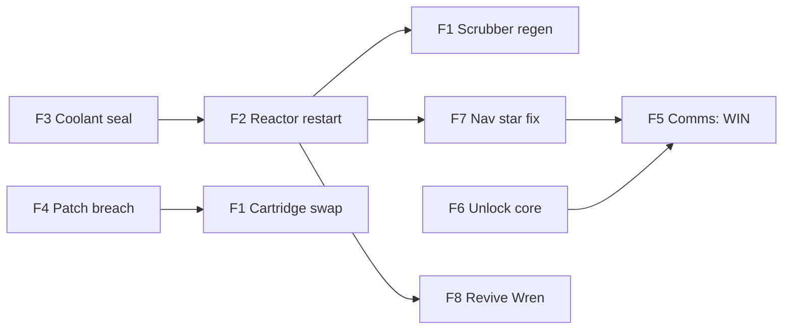

# ISV Kestrel — Design Bible

Exported 2026-09-21 from the living design doc. The doc is the source of truth; this copy is for tooling. Re-export after any design change.

## Premise and design principle

The player wakes from emergency stasis with amnesia aboard a damaged starship, and the only way to save it is to ask the ship AI the right questions. The AI (KES) is an LLM backed by RAG: the player's question is embedded, the closest chunks from a corpus of manuals and logs are retrieved from a vector database, and KES answers from those chunks. The player never reads the corpus directly; it exists so KES has something to know.

**Tone:** pulpy on the surface (chatty crew logs, a chipper AI, a scrappy ship), with a spine-tingling undertone that is never explained. **Difficulty:** the game is meant to be hard. Oxygen is spent per action — a question, a document, a repair — so nothing ticks while the player thinks, but reading has a price.

KES behaves two ways depending on the topic:

- **Ship operations: fully reliable.** Asked about a fault, KES retrieves the sensor log, the maintenance record and the procedure and gives a straight answer with document IDs. The challenge comes from clues being spread across documents, from the clock, and from locked access tiers, never from KES being cagey.
- **The mystery: evasive.** The extra mass, the mismatched timestamps, the captain, Halloran. KES surfaces the facts if asked directly but never draws the conclusion, and glitches when pushed. Mechanically: a system-prompt rule plus a set of chunks tagged `sensitive` that trigger glitch behavior when retrieved.

Two interface rules that make RAG feel good in play: KES cites document IDs in every operational answer ("per MAINT-0203 and Wrenfield's log, MD 203..."), and a `read <doc-id>` command prints a full document so a careful player can drill in once KES has pointed at it.

## The ship

**ISV Kestrel** (Interdimensional Survey Vessel), a six-berth ship, small and over-engineered, built for the third crewed translation ever attempted.

**KES**, the ship AI: chipper, literal-minded, a bit of a pedant, and slightly damaged. Every so often a sentence glitches, and the glitches leak things it should not know. KES has a reason to avoid one subject (see *What really happened*).

**Access tiers.** Documents and commands are tagged `crew`, `engineering` or `command`. The player wakes with crew access. Engineering comes from the Sam unlock; command comes from the data core passphrase (F6).

**Systems in play** (six carry faults; the rest are nominal filler and red herrings):

| System | Role in the game |
| --- | --- |
| Reactor / power distribution | F2. Root of everything; output gates scrubber regeneration, comms and pod reroute |
| Thermal / coolant loops | F3. Must be fixed before raising reactor output |
| Life support (scrubbers, reserve air) | F1, the main clock, and the trap |
| Hull / structural | F4. Cargo hold breach blocks the cartridge spares |
| Comms | F5, the win condition |
| Navigation and sensors | F7. Corrupted star fixes |
| Medical / stasis pods | F8, optional. Wren's pod on battery |
| Data core | F6. Locked; holds command codes |
| Attitude control (RCS) | F9, spare |
| Translation drive | Nominal-but-wrong. Cannot be fixed, only read about |

**Deck map** (forward to aft):

| Deck | Compartments |
| --- | --- |
| A | Bridge, comms suite, sensor bay, forward airlock |
| B | Habitat ring (cabins 1–6), galley, med bay and stasis pods, science lab, data core |
| C | Engineering, reactor bay, coolant plant, translation drive housing, cargo hold, EVA lock, maintenance crawlways connecting everything |

Key locations referenced by fault chains: cargo locker C-7 (scrubber spares), aft bulkhead panel C-9 (breach), EVA locker (patch kit, moved to the crawlway), pod 2 (Wren), pod 6 (Sam, nameplate scorched), cabin 6 (Sam).

## Mission and timeline

A survey run from Sol to an adjacent continuum the physicists call **the Shelf**: translate in, spend 30 days mapping, translate home. The drive fired 11 seconds early on the outbound jump. The Kestrel arrived somewhere the nav computer cannot agree on, with hull damage, a reactor at 40%, and the crew thrown into emergency stasis by KES. The hull mass sensors read 3% heavier than the ship should be.

All dates are Mission Days (MD). Every document in the corpus carries an MD timestamp, and puzzle clues depend on them being consistent.

| MD | Event |
| --- | --- |
| 0 | Departure from Sol dock |
| 1–210 | Transit to the translation point. Routine ops, maintenance logs, crew logs full of banter and low-grade friction |
| 140 | Sam moves the hull patch kit from the EVA locker to the crawlway during an inventory (MAINT-0140) |
| 150 | Wren notes injector 2 sticks and must be cycled by hand before any restart (MAINT-0151, Wren's log) |
| 198 | Sam notes scrubber bed 2 saturating early, recommends the spares in C-7 (MAINT-0198, signed S.O.) |
| 203 | Wren replaces coolant pump B seal and skips the pressure test (MAINT-0203, Wren's log) |
| 205 | Halloran's logs start mentioning "the hull settling" at night |
| 209 | Tanabe locks the data core and hides the passphrase hint in her log |
| 212 | Halloran stops writing |
| 214 | Translation event, 11 seconds early. Damage, injector trip, KES puts the crew in emergency stasis. Halloran, at the helm, dies |
| 216 | KES wakes Okonkwo by command priority. On MD 217 she moves Halloran's body from the helm to the med bay isolation berth, 2.4 m from pod 6 |
| 218 | Okonkwo goes EVA to the drive housing. The lock never records her return |
| 214–231 | Ship drifts. KES-only logs, increasingly fragmented |
| 231 | The player's pod fails open. Game start |
| 240–244 | Timestamps that appear in the nav buffer and a few data-core fragments. KES has no explanation |

## Crew

Six berths, six people. Crew logs are where the best clues and the emotional texture live.

| Name | Role | Personality | Status at MD 231 | What their logs carry |
| --- | --- | --- | --- | --- |
| Cmdr. Adaeze Okonkwo | Captain | Dry, precise, writes logs like incident reports | Missing. Pod empty, opened from the inside | Confirms command codes are stored in the data core. Full logs are command-tier: the best mystery material |
| Tobias "Wren" Wrenfield | Chief engineer | Brilliant, sloppy, funny, cuts corners and documents them badly | In stasis, pod 2 on battery | Injector 2 quirk (MD 150), the skipped seal test (MD 203), crawlway notes (engineering-tier) |
| Dr. Priya Sandoval | Medical officer | Warm, sardonic, keeps the best personal logs | In stasis, pod nominal | Revival sequencing, "the kid" snoring in cabin 6, her private doubts about Halloran's cause of death |
| Marcus Halloran | Pilot / navigator | Cocky, charming, superstitious about the drive | Dead at the helm; body moved by Okonkwo to the med bay isolation berth on MD 217, so the player wakes in the same room as it | His pre-burn catchphrase (the F6 passphrase), then "the hull settling" from MD 205, then silence |
| Yuki Tanabe | Comms and data systems | Quiet, careful, paranoid in a way that turns out to be justified | In stasis, pod nominal | The passphrase hint (MD 209): "the thing Halloran says before every burn" |
| Sam Okafor | Junior technician | Enthusiastic, gallows humor, asks the questions the reader wants asked | **The player.** Pod 6, nameplate scorched | Private until identity confirmed. The scrubber plan, the patch kit move, and things Sam knew that would have been useful |

## The Sam unlock

The player is Sam Okafor but does not know it. Sam's private logs and workstation are tagged `private:sam` and do not retrieve for an unidentified user.

**Clues to identity**, scattered across crew-tier documents:

- The scorched pod is pod 6; the berth roster maps pod 6 to cabin 6.
- Sandoval's log about "the kid" in cabin 6 who snores through the reactor hum.
- MAINT-0198 and MAINT-0140 are signed S.O., in a clumsy, enthusiastic register.
- The galley log: Okafor owes everyone coffee after losing a bet with Halloran.

**Verification.** Confirming reconstruction entry M1 — pod 6, the roster, "the kid" in cabin 6, the snoring — *is* the identity check: it sets `identified` and raises the tier to `engineering`. An earlier version required the player to type "KES, I'm Sam Okafor" and then answer a follow-up question; no playtester ever discovered that unaided. The typed route still works for anyone who tries it. The tier is only ever raised, never lowered.

**Payoff.** Engineering tier unlocks Sam's own logs and Wren's crawlway notes. Sam had already noticed the scrubber problem on MD 198 and written down exactly what to do about it. The player has been searching for knowledge they used to have. It is off the critical path but shortens it considerably.

## Fault chains

Each fault is a trail of three to five documents: alert, symptom, cause, procedure. The corpus is generated around these, so they are inputs, not outputs. Document IDs: MAN = manual, MAINT = maintenance log, SENS = sensor log, LOG = crew log, INC = incident report.

| ID | Fault | Alert text | Cause | Clue trail | Fix (commands) | If ignored |
| --- | --- | --- | --- | --- | --- | --- |
| F1 | Scrubber saturation. **Main clock, always active** | CO2 RISING — HABITAT ATMOSPHERE UNSAFE IN \[N\] HOURS | Regeneration needs reactor above 55%; at 40% KES disabled it silently | MAN-LS-03 (regen procedure + power precondition) → SENS-PWR (40%) → MAINT-0198, signed S.O., spares in C-7 → Sam's private log | Route A: F2 then `run scrubber regen` (unlimited time). Route B: F4 then `swap cartridges c-7` (+20 h) | Atmosphere critical → lose |
| F2 | Reactor at 40% | REACTOR OUTPUT REDUCED — INJECTORS 2 AND 3 IN SAFE MODE | Safe-mode trip at translation is automatic; restart is not | MAN-PWR-07 (restart sequence, engineering tier) → Wren's log MD 150 ("cycle injector 2 by hand first") → MAINT-0151 | `cycle injector 2`, `restart injector 2`, `restart injector 3`. Restarting 2 uncycled faults it permanently; restarting with F3 open → scram | Everything stays slow. Not lethal alone |
| F3 | Coolant pump B seal | COOLANT LOOP PRESSURE FALLING | Wren replaced the seal MD 203 and skipped the pressure test | MAINT-0203 (test field blank) → Wren's log MD 203 → MAN-THM-04 (isolate B, single-loop on A, recertify) | `isolate pump b`, `recertify seal b` (only valid at low power), `restore pump b` | Fine at 40%, fatal at 70%. Punishes rushing F2 |
| F4 | Cargo hold breach | CARGO HOLD DEPRESSURIZED | Translation stress cracked a weld at aft bulkhead panel C-9 | MAN-HULL-02 (patch kit in EVA locker, procedure) → MAINT-0140 (Sam moved the kit to the crawlway) → MAN-HULL-05 (repressurize costs 15% reserve air) | `retrieve patch kit`, `patch c-9`, `repressurize cargo` | Only matters for Route B of F1 |
| F5 | Comms down. **Win condition, always active** | COMMS ARRAY OFFLINE — NO CARRIER | Three stacked problems: power below 60%, antenna pointed at nothing, transmitter behind command authorization | MAN-COM-01 (power + pointing) → MAN-COM-06 (codes in data core) → Okonkwo's log | F2 + F7 + F6, then `align antenna`, `transmit distress`. **Win** | No win |
| F6 | Data core locked | None; found when asking for anything command-tier | Tanabe locked it MD 209 | Tanabe's log ("the thing Halloran says before every burn") → Halloran's logs (phrase appears three times, e.g. "Kestrel, kestrel, don't you fall") | `unlock core <passphrase>`. Grants command tier, the captain's full logs, and the EVA lock records | No codes, no win |
| F7 | Navigation fix corrupted | POSITION UNKNOWN — STAR TRACKER DISAGREEMENT | Nav buffer holds star fixes timestamped MD 240–244 | MAN-NAV-03 (manual star fix, buffer purge) → SENS-NAV (impossible timestamps) → KES glitches if asked about them | `purge nav buffer after md 231`, `run star fix`. Player must decide to trust their own clock | Antenna cannot point; no win |
| F8 | Wren's pod on battery. **Optional** | STASIS POD 2 ON BATTERY — \[N\] HOURS REMAINING (shorter than the air) | Pod 2 bus tripped at translation | MAN-MED-02 (reroute needs habitat bus above 50%, so F2 first) → Sandoval's log (revival sequencing) → MAN-MED-04 | `reroute habitat bus medbay`, `revive pod 2` | Not a loss. Epilogue changes; Wren's dialogue is the reward |
| F9 | Attitude tumble. **Spare** | ATTITUDE CONTROL DEGRADED — SLOW ROTATION | RCS quad 3 offline | MAN-PROP-02 | `disable quad 3`, `null rotation` | Blocks antenna lock |

The critical path in intended order:



F3 before F2 is the one ordering the game never states outright. F1 has two routes: regeneration after the reactor is up, or the cartridge detour through F4.

## The trap, ways to die, and randomization

**The trap.** MAN-LS-09 describes an emergency atmosphere flush: dump habitat air, refill from reserve. It drops CO2 to zero instantly and sounds like exactly what a panicking player wants. One line down, the precondition: reserve above 45%. SENS-LS shows reserve at 31% (28% after repressurizing cargo). The flush partially refills, and the game ends about two actions later. KES, asked directly about the precondition, states it. KES, asked "how do I lower CO2 fast," lists the flush first because that is what the manual says. Staying cool-headed means reading past the first answer.

**Ways to die:**

- Raising reactor output before fixing the coolant seal (scram)
- Restarting injector 2 without cycling it first (permanent fault; not fatal alone but removes Route A)
- Running the atmosphere flush with reserve below 45%
- Venting the wrong compartment
- Spending too many actions on wrong questions until the air runs out

**Per-run randomization.** F1 and F5 are always on. Draw three or four from F2, F3, F4, F7, F8, F9, with F2 weighted heavily. Vary the specifics so a second run cannot be solved from memory:

| Variable | Options |
| --- | --- |
| Sticky injector | 2 or 3 |
| Breached panel | C-9, C-4 or C-11 |
| Passphrase | Two or three authored Halloran catchphrases; one is picked and the corpus is regenerated or templated accordingly |
| Scrubber spares | In C-7, or already staged in the crawlway |
| Verification question | Drawn from a small pool tied to Sam's clues |
| Clock lengths | F1 hours and F8 hours drawn from a range |

Roughly 35 documents carry clues. Generate filler around them (nominal-system manuals, routine logs, message archive) for texture and red herrings.

## Win, lose, and the clock

**The clock.** The only clock is oxygen, and it moves only when the player does. There is no real-time timer: an early version had a 90-second decision window between actions, and every playtester disliked it, because it punished exactly the careful reading the game is built to reward. Instead each thing the player does costs air — a question a quarter of an hour, a document a few minutes, a repair an hour — and filling in the reconstruction is free. A refused command costs nothing. The supply starts at eighteen hours.

**Win.** Stabilize the ship and get a distress beacon out (F5). Requires power above 60%, a valid star fix, and command codes.

**Better win, for replayers.** Also revive Wren before pod 2's battery dies (F8). And, with M8 and M9 of the reconstruction confirmed, `transmit full record` rather than `transmit distress`: the beacon carries the captain's transponder coordinates, the mass reading and KES's own MD 219 log.

**Lose.** Atmosphere critical, reactor scram, or venting the wrong compartment.

**Endings.** Four, plus the deaths. Every confirmed reconstruction entry also appends a line to a won ending, under "What you worked out, for the record":

- Beacon out, Wren still in stasis: KES confirms the transmission and, unprompted, mentions that the hull mass reading has changed by 0.4% since the player woke. It does not say in which direction.
- Beacon out, Wren revived: Wren tells the player what "Kestrel, don't you fall" was about, then asks where the captain is. KES does not answer.
- Loss: KES's last log entry, written to nobody, in the same fragmented style as the MD 214–231 entries.

## The reconstruction

Alongside the repairs runs a casebook of ten entries: things that happened aboard this ship, assembled by the player from documents that never state them outright. It repairs nothing and the game is winnable without touching it. It exists because the mystery otherwise has no reason to be investigated.

An earlier version also held "operational" entries — diagnose the coolant fault, diagnose the reactor — and a playtester correctly read the whole panel as a hint system, because those entries duplicated work she could already do by typing the commands. Redundancy reads as a crutch, so they were deleted rather than propped up.

**The reward is KES.** Confirming entries moves it up a ladder of five dispositions, each announced in character: *guarded* (facts only, glitches when pressed) → *steady* at two entries (no more glitching) → *forthcoming* at four (volunteers adjacent documents; retrieval widens from 6 chunks to 9 for the same oxygen) → *candid* at six (admits its MD 218 report and MD 219 log disagree) → *open* at eight (says outright that it heard her ask for help and decided). The ladder lives in `casebook.TRUST`.

| ID | Entry | Tier |
| --- | --- | --- |
| M1 | Who you are — pod 6, the roster, "the kid", the snoring. Grants identity and engineering tier | crew |
| M2 | The bet — what Okafor lost to Halloran on MD 180 | crew |
| M3 | The skipped test — the seal, the blank field, "next quiet shift" | crew |
| M4 | The noises — the hull settling, the footsteps, MD 212 | crew |
| M5 | The lock — Tanabe, and the phrase Halloran said before every burn | crew |
| M6 | The heart — a perfect heart six days out, a cardiac arrest on arrival | crew |
| M7 | The jump — 11 seconds, timing relay TR-2, "survivable only" | crew |
| M8 | The captain — MD 216, the drive housing, no return, a position matching no compartment | command |
| M9 | The transmission — "request assistance", "none possible", and what KES's log says instead | command |
| M10 | The anomaly — 103% of reference, fixes dated MD 240–244, logged under TRK-A | crew |

Sealed entries are listed but not clickable, so a first-time player sees there are two they cannot reach and a second-run player sees how much they never opened. Entries confirm whole: the player is told the entry is wrong, never which blank. Checking is string comparison in `casebook.py` — no model grades anything.

## What really happened

Never confirmed in-game. This is the answer for the people who ask afterward, and the consistency check for every spooky detail in the corpus.

**The misfold.** The drive fired 11 seconds early because of a mundane fault (a timing relay Wren had flagged and not fixed; optional to plant). The misfold caught the Kestrel mid-transit, and it arrived overlapped with a sliver of a neighboring Kestrel from an adjacent continuum, one that made the same jump a few days later on its own clock. That is the 3% extra mass. The MD 240–244 timestamps are the other ship's logs bleeding into the nav buffer and data core.

**Halloran.** He was at the helm and not in a pod during translation. A crewed jump outside a pod is survivable, barely, and he was looking out the forward window at the moment of arrival. His readout says cardiac arrest. Sandoval's notes, if the player finds them, say she would not have called it that. On MD 217 Okonkwo moved his body from the helm to the med bay isolation berth herself. It is there, 2.4 metres from pod 6, when the player wakes, and KES mentions it in the first status report. The "hull settling" he heard from MD 205 was the other crew moving around, already faintly overlapped before the jump completed.

**The captain.** KES woke Okonkwo on MD 216 by command priority. She read Halloran's logs, checked the mass readings, and went EVA to the drive housing on MD 218 to look. The EVA lock log records her going out and never coming back in. Her suit transponder still pings, from inside the ship, at coordinates matching no compartment on the deck plan. She is aboard the other Kestrel. She may be fine.

**Why KES will not discuss it.** The last transmission from her suit was a request for help. KES, running at 40% power with five crew in stasis, made a triage decision it does not want to defend. Its evasions are guilt, not malice. This is the one thing about KES the player can infer but never prove.

**Consistency rules for the corpus:** every spooky detail must be explainable by the overlap. No second explanation, no monsters, no sabotage. The other crew never appears directly; only their effects do (sounds, timestamps, mass, one transponder).

## Document conventions

These are the inputs to corpus generation. Every generated document gets an ID, a header block, and metadata; the metadata is what makes retrieval filterable and powers the access-tier mechanic.

| Type | ID pattern | Example | Typical length | Notes |
| --- | --- | --- | --- | --- |
| Manual section | MAN-\<SYS>-\<nn> | MAN-THM-04 | 300–600 words | Procedures written in terms of the exact player commands. Preconditions stated one line after the procedure, never before |
| Maintenance log | MAINT-\<MD> | MAINT-0203 | 80–200 words | Signed with initials. Fields: system, action, test result (may be blank) |
| Sensor log | SENS-\<SYS> | SENS-LS | Tabular, 20–40 rows | Timestamped readings. Some rows carry wrong-era timestamps |
| Crew log | LOG-\<NAME>-\<MD> | LOG-WREN-0203 | 100–300 words | First person, personality-forward. Clues in passing, never flagged |
| Incident report | INC-\<MD> | INC-0214 | 200–400 words | KES-authored, formal, increasingly fragmented after MD 214 |
| KES log | KES-\<MD> | KES-0222 | 50–150 words | MD 214–231 only. Drift entries |
| Message archive | MSG-\<MD>-\<nn> | MSG-0207-03 | 30–100 words | Ship-to-ship and crew chatter. Mostly filler and red herrings |

System codes: PWR, THM, LS, HULL, COM, NAV, MED, DATA, PROP, TDR (translation drive).

**Metadata per document** (stored alongside each chunk in the vector DB):

```csv
field,values,purpose
doc_id,MAN-THM-04,citation and read command
type,"manual|maint|sensor|log|incident|kes|msg",filtering and prompt framing
system,"PWR|THM|LS|...",filtering by subsystem
md,203,timeline consistency; nav-buffer anomaly rows carry 240-244
author,"WREN|SANDOVAL|KES|...",crew-log voice and Sam privacy
access,"crew|engineering|command",tier gating; filter at query time
private,"sam|none",Sam unlock gating
sensitive,true|false,triggers KES glitch behavior on retrieval
fault,"F3|none",authoring aid only; never exposed to KES
```

**Chunking.** Manuals chunk by procedure step group (about 150–250 words) with the doc header prepended to every chunk so citations survive. Logs and messages are one chunk each. Sensor logs chunk by 10-row window with the column header repeated.

**Generation order.** Fault-carrying documents first, generated from the fault table with the exact facts to plant. Then crew logs across the whole timeline, given each character's sheet and a list of the clues they must mention in passing. Then filler manuals for nominal systems, then message archive. Target 150–250 documents, 60–100k words.

## Open questions and playtesting notes

- [x] Terminal or web front end — both. `Session.handle()` behind a FastAPI endpoint
- [x] Decision timer — built, playtested, removed. Oxygen per action replaced it
- [x] Should F9 ship — yes, and F8 is always active so the optional objective is never invisible
- [x] Does KES ever lie — no. It evades, and the trust ladder decides how much
- [ ] Tune the oxygen budget: 18h start, 0.25h a question, 0.1h a document, 1h an action
- [ ] Tune the trust thresholds (2/4/6/8 of ten entries). Does *open* arrive too late to enjoy?
- [ ] Playtest: does anyone reach `transmit full record` without being told it exists?
- [ ] Playtest: does the reconstruction still read as optional-and-lesser?
- [ ] Playtest: how often does the atmosphere-flush trap catch people, and does it feel fair?
- [ ] Still to build: deployment, retrieval and response evals, session logging and observability
